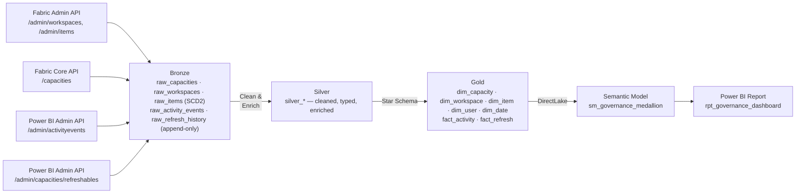

# Fabric Governance

[](https://github.com/amxavier/fabric-governance/actions/workflows/ci.yml)
[](https://github.com/amxavier/fabric-governance/actions/workflows/cd_deploy.yml)
[](https://github.com/amxavier/fabric-governance/actions/workflows/schedule_ingestion.yml)

Tenant-wide governance for **Microsoft Fabric**, built as a Medallion Architecture pipeline: who published or refreshed what, when, and whether it failed — so an incident like "this report stopped refreshing" can be diagnosed from data instead of digging through the Fabric portal by hand.

Data sources: Fabric Admin REST API (`/admin/workspaces`, `/admin/items`), Fabric Core REST API (`/capacities` — there's no admin-scoped equivalent), and the Power BI Admin REST API (`/admin/activityevents`, `/admin/capacities/refreshables`).

Sibling project: [microsoft-fabric-medallion-lakehouse](https://github.com/amxavier/microsoft-fabric-medallion-lakehouse) — this repo reuses its CI/CD and notebook conventions, but is architecturally independent (tenant-wide Admin API scope vs. per-workspace scope).

---

## Architecture



### Layer Responsibilities

| Layer | Table(s) | Description |
|-------|----------|-------------|
| **Bronze** | `raw_capacities`, `raw_workspaces`, `raw_items` | Tenant-wide snapshots, **SCD Type 2** — capacity/workspace/item metadata changes are preserved from the earliest layer |
| **Bronze** | `raw_activity_events`, `raw_refresh_history` | Append-only — audit events and refresh runs are immutable by nature |
| **Silver** | `silver_*` | Cleaned, typed, joined for readability (capacity name, workspace name, item type/name) |
| **Gold** | `dim_capacity`, `dim_workspace`, `dim_item`, `dim_user`, `dim_date` | Governance star schema dimensions |
| **Gold** | `fact_activity`, `fact_refresh` | One row per audit event / per refresh run, keyed to the dimensions above |

The core diagnostic pattern this schema enables: join `fact_refresh` failures against `fact_activity` for the same `item_id` in the preceding window — did someone change the owner, republish, or edit parameters right before it broke?

---

## Tech Stack

| Component | Technology |
|-----------|------------|
| Platform | Microsoft Fabric |
| Storage | OneLake (Delta Lake) |
| Processing | PySpark (Spark 3.x) |
| Orchestration | Fabric Data Pipeline |
| Semantic Layer | Power BI Semantic Model (DirectLake) |
| Reporting | Power BI Report (PBIR format) |
| CI/CD | GitHub Actions |
| Auth | Azure AD Service Principal (tenant Admin API scope) |
| Deployment | Fabric REST API (direct, 3-phase) |

---

## Environments

This project **reuses the same three Fabric workspaces and Service Principal** as the sibling [microsoft-fabric-medallion-lakehouse](https://github.com/amxavier/microsoft-fabric-medallion-lakehouse) project, same branch-to-workspace mapping — but that project never needed tenant-wide Admin API access (it only deploys into workspaces it's already a member of), so that access had to be granted separately for this project — see [Getting Started](#getting-started).

```
dev branch  →  DEV workspace  (dc072922-4ffb-4424-868c-28087b02ecba)
qa branch   →  QA workspace   (4bf443aa-d454-4c66-9025-a67fe4a287a8)
main branch →  PRD workspace  (990e6ef6-cc9a-47cf-8258-af5bc66bbad8)
```

Within each of those workspaces, this project adds its **own**, separately-named Lakehouse trio — `lh_governance_bronze`, `lh_governance_silver`, `lh_governance_gold` — so governance tables never mix with the crypto project's `lh_bronze`/`lh_silver`/`lh_gold` tables in the same workspace. Environment-specific GUIDs are managed in `config/valueSets/` — the `workspace_id` values are the real, already-existing IDs above; the `lh_governance_gold` lakehouse ID is still a placeholder until that lakehouse is created (see [Getting Started](#getting-started)).

---

## Workflows

| File | Trigger | Purpose |
|------|---------|---------|
| `ci.yml` | Every push | Validates all Fabric artifacts exist; runs `tests/` |
| `cd_deploy.yml` | Push to `dev`, `qa`, `main` | Deploys changed artifacts to the matching workspace via REST API |
| `schedule_ingestion.yml` | Daily at 06:00 UTC | Triggers `pl_governance_orchestration` in DEV, QA, and PRD |

Same 3-phase deploy order and patching strategy (pipeline notebook IDs, report `byConnection`, DirectLake OneLake URL) as the sibling project — see its README for the detailed rationale, which applies unchanged here.

---

## Semantic Model — DAX Measures

| Measure | Description |
|---------|-------------|
| `Total Refreshes` | Count of all refresh runs |
| `Failed Refreshes` | Count of refresh runs with a failure status |
| `Refresh Success Rate %` | Share of refreshes that succeeded |
| `Avg Refresh Duration (s)` | Average refresh duration |
| `Distinct Publishers` | Distinct users who triggered a logged activity |
| `Days Since Last Successful Refresh` | Staleness indicator per filter context |

---

## Project Structure

```
fabric-governance/
│
├── lh_governance_bronze.Lakehouse/
├── lh_governance_silver.Lakehouse/
├── lh_governance_gold.Lakehouse/
│
├── .github/workflows/
│   ├── ci.yml
│   ├── cd_deploy.yml
│   └── schedule_ingestion.yml
│
├── config/valueSets/
│   ├── dev.json / qa.json / main.json   # real workspace ID (reused) + OneLake URL (lakehouse ID still placeholder)
│
├── scripts/
│   ├── deploy.py                        # 3-phase deploy orchestration
│   ├── fabric_client.py                 # Fabric REST API + Power BI REST API wrapper
│   └── utils.py                         # Artifact helpers: patch, encode, diff
│
├── notebooks/
│   ├── nb_bronze_capacities.Notebook/
│   ├── nb_bronze_workspaces.Notebook/
│   ├── nb_bronze_items.Notebook/
│   ├── nb_bronze_activity_events.Notebook/
│   ├── nb_bronze_refresh_history.Notebook/
│   ├── nb_silver_capacities.Notebook/
│   ├── nb_silver_workspaces.Notebook/
│   ├── nb_silver_items.Notebook/
│   ├── nb_silver_activity_events.Notebook/
│   ├── nb_silver_refresh_history.Notebook/
│   └── nb_gold_governance_model.Notebook/
│
├── pipelines/pl_governance_orchestration.DataPipeline/
├── semantic models/sm_governance_medallion.SemanticModel/
├── report/rpt_governance_dashboard.Report/
│
├── tests/
├── requirements.txt
└── README.md
```

---

## Getting Started

This project deliberately reuses existing infrastructure rather than provisioning its own — the three Fabric workspaces and the Service Principal already exist for the sibling [microsoft-fabric-medallion-lakehouse](https://github.com/amxavier/microsoft-fabric-medallion-lakehouse) project. The only new infrastructure this project needs is its own Lakehouse trio inside those same workspaces.

### Remaining manual steps (not automatable via CI/CD)

1. **Create `lh_governance_bronze`, `lh_governance_silver`, and `lh_governance_gold`** in each of the three existing workspaces (DEV/QA/PRD), then replace the placeholder lakehouse GUID with the real ID Fabric assigns to `lh_governance_gold` once created (bronze/silver too, in every notebook's METADATA/`known_lakehouses`) — same pattern the sibling project uses for its own lakehouses.

2. **Bootstrap delegated authentication for the four `/admin/*`-calling notebooks** (`nb_bronze_workspaces`, `nb_bronze_items`, `nb_bronze_activity_events`, `nb_bronze_refresh_history`) — see [Delegated Authentication](#delegated-authentication-for-admin) below for why this is needed and the one-time setup (interactive device-code sign-in), which populates a small Delta table (`_auth_delegated`) in `lh_governance_bronze` that these notebooks read from on every run.

3. **Configure the pipeline's `refresh_semantic_model` activity** (a native `PBISemanticModelRefresh` step, the last activity in `pl_governance_orchestration` — refreshes `sm_governance_medallion` so Direct Lake picks up each run's new Gold data without anyone having to click Refresh manually). This activity's `typeProperties.groupId`/`datasetId` and `externalReferences.connection` are environment-specific and reference a Connection resource `deploy.py` has no automation for — after deploying to a new environment, open the pipeline in the portal, re-point this activity at that environment's own `sm_governance_medallion` (creating a new Connection if prompted), then use `scripts/pull_item_definition.py` (or the `Pull Semantic Model Definition` workflow, with `format` set to the sentinel `NONE`) to sync the corrected IDs back into `pipeline-content.json`.

### Required GitHub Secrets

Same Service Principal as the sibling repo — these are the same *values*, just configured as secrets in this repository too (GitHub secrets don't cross repositories even when the underlying identity is shared):

| Secret | Description |
|--------|-------------|
| `AZURE_TENANT_ID` | Azure AD Tenant ID |
| `AZURE_CLIENT_ID` | Shared Service Principal Application (Client) ID |
| `AZURE_CLIENT_SECRET` | Shared Service Principal Client Secret (Value, not ID) |
| `FABRIC_WORKSPACE_ID_DEV` / `_QA` / `_PRD` | Same workspace GUIDs as `config/valueSets/*.json` (not sensitive, but `schedule_ingestion.yml` reads them from secrets rather than the repo) |
| `FABRIC_PIPELINE_ID_DEV` / `_QA` / `_PRD` | `pl_governance_orchestration` item GUID per environment — only known after the first deploy |

### Setup

1. Create `lh_governance_bronze`, `lh_governance_silver`, `lh_governance_gold` in the DEV workspace (`dc072922-4ffb-4424-868c-28087b02ecba`).
2. Replace the placeholder lakehouse GUID `00000000-0000-0000-0000-0000000000e3` in `config/valueSets/dev.json` and in every notebook's METADATA block with the real `lh_governance_gold` ID (and the corresponding `lh_governance_bronze`/`lh_governance_silver` placeholders `...-e1`/`...-e2` where each notebook references its own default lakehouse).
3. Add the GitHub secrets above (reuse the same Service Principal values already used by the sibling repo).
4. Run `CD - Deploy to Fabric` in **full** mode to bootstrap DEV.
5. Run the one-time delegated-auth bootstrap described below.
6. Repeat steps 1–2 for QA and PRD once DEV is validated, then push to `qa`/`main` to promote (each environment needs its own `_auth_delegated` bootstrap, since it's per-lakehouse).

---

## Delegated Authentication for `/admin/*`

Every `/admin/*` endpoint this project depends on — Fabric's `/v1/admin/workspaces` and `/v1/admin/items`, and Power BI's `/admin/activityevents` and `/admin/capacities/refreshables` — **rejected the Service Principal outright**, no matter how it authenticated:

- `notebookutils.credentials.getToken("pbi")` inside a pipeline-triggered notebook run → 403
- A raw `client_credentials` OAuth call using the same SP's secret → 401 "Authorization Context Requested but not available"
- Both produced a token that decoded to a genuine, correctly-scoped app-only SP token (`idtyp: app`, `oid` matching the SP's actual object ID) — so this isn't a misconfigured tenant setting or wrong credential, confirmed by exhaustively checking: Entra security group type and membership, the two "Admin API settings" toggles, absence of conflicting admin-consent permissions, and a Power BI `Tenant.Read.All` **Application** permission with admin consent (which per [Microsoft's own docs](https://learn.microsoft.com/en-us/fabric/admin/enable-service-principal-admin-apis) should not even be combined with the security-group method — tried anyway, no change)
- An **interactively-obtained delegated user token** (Device Code flow + MFA + a `Tenant.Read.All` **Delegated** permission, admin-consented) succeeded immediately (`200 OK`)

This matches reports from the [Fabric community](https://community.fabric.microsoft.com/t5/Developer/Admin-API-s-and-Service-Principal-Authentication-401/m-p/3134240) of the same symptom: some Admin APIs — likely because several are still **Preview** — simply don't support app-only authentication yet, regardless of tenant configuration.

**The workaround**: the four affected notebooks exchange a stored **refresh token** (obtained once via interactive sign-in) for a fresh delegated access token on every run, via `_get_delegated_token()`. The refresh token — and the new one Microsoft issues on every redemption — lives in a small Delta table, `_auth_delegated`, inside `lh_governance_bronze`. This needed no new infrastructure (no Key Vault, no pipeline parameters): `tenant_id`/`client_id` aren't secrets, and the refresh token never leaves the lakehouse, which only the workspace's own members can see — same protection level a Key Vault would add here, at zero cost.

### One-time bootstrap (per environment)

Run this interactively in any notebook attached to the environment's `lh_governance_bronze` (delete the cell afterward — it briefly holds a device code, not a secret, so it's low-risk, but no need to leave it lying around):

```python
import requests
from datetime import datetime, timezone

TENANT_ID = "<tenant id>"          # not a secret
CLIENT_ID = "<sp-fabric-cicd client id>"  # not a secret — but its App Registration
                                            # needs "Allow public client flows" = Yes

dc = requests.post(
    f"https://login.microsoftonline.com/{TENANT_ID}/oauth2/v2.0/devicecode",
    data={"client_id": CLIENT_ID, "scope": "https://api.fabric.microsoft.com/.default offline_access"},
).json()
print(dc["message"])  # open the URL, enter the code, sign in (MFA if prompted)

# Run this cell AFTER completing the browser sign-in above:
poll = requests.post(
    f"https://login.microsoftonline.com/{TENANT_ID}/oauth2/v2.0/token",
    data={
        "grant_type": "urn:ietf:params:oauth:grant-type:device_code",
        "client_id": CLIENT_ID,
        "device_code": dc["device_code"],
    },
).json()

_lh = notebookutils.lakehouse.get("lh_governance_bronze")
spark.createDataFrame([{
    "tenant_id": TENANT_ID,
    "client_id": CLIENT_ID,
    "refresh_token": poll["refresh_token"],
    "updated_at": datetime.now(timezone.utc).isoformat(),
}]).write.format("delta").mode("overwrite").save(f"{_lh['properties']['abfsPath']}/Tables/_auth_delegated")
```

**Prerequisites for this to work:**
- The app registration (`sp-fabric-cicd`) needs **"Allow public client flows"** enabled (Azure Portal → App registration → Authentication → Settings tab).
- It needs a **Delegated** (not Application) `Tenant.Read.All` permission for Power BI Service, with admin consent granted.
- The signed-in user needs whatever role actually grants Admin API visibility in this tenant (in practice: being able to open the Fabric Admin Portal was a reliable proxy for this).

**Operational note:** the refresh token is valid on a sliding window (typically ~90 days of inactivity before Microsoft invalidates it) and is rotated automatically by `_get_delegated_token()` on every use, so daily runs should keep it alive indefinitely. If it ever does expire, re-run this bootstrap once per environment.

---

## Key Design Decisions

**SCD Type 2 in Bronze, not Silver** — Unlike the sibling lakehouse project (which applies SCD2 in Silver), this project versions capacity/workspace/item metadata as early as possible, in Bronze. The goal is change-history as a governance signal in its own right (e.g. "this workspace moved to a Trial capacity two days before refreshes started failing"), so it can't be lost or smoothed over by any transformation step downstream.

**Generic `raw_items`/`dim_item` instead of one table per item type** — Report, SemanticModel, Lakehouse, SQLEndpoint, DataPipeline, Notebook, and Dataflow are all rows in the same table, discriminated by `item_type`. This mirrors how the Admin API itself returns items and avoids maintaining eight near-duplicate schemas.

**Two separate audit sources, joined in Gold** — the Activity Log only attributes a user to *on-demand* refreshes; scheduled refreshes never show up there. `raw_refresh_history` captures every refresh (status, duration, error), while `raw_activity_events` captures who did what. Only by combining both in `fact_activity`/`fact_refresh` can "did this fail because of something someone changed?" be answered.

**Change-detection before SCD2 merge** — Bronze dimension notebooks only expire+reinsert a row when a tracked attribute actually changed, not on every daily run. Unlike the sibling project's crypto price data (which genuinely changes every day), tenant metadata is mostly stable day to day — versioning every row regardless would make the change history noise instead of signal.

---

## Author

**Andrelino Xavier** — Data Engineer
[GitHub](https://github.com/amxavier)

---

*Built as a Data Engineering portfolio project to demonstrate enterprise-realistic Fabric governance practices.*
