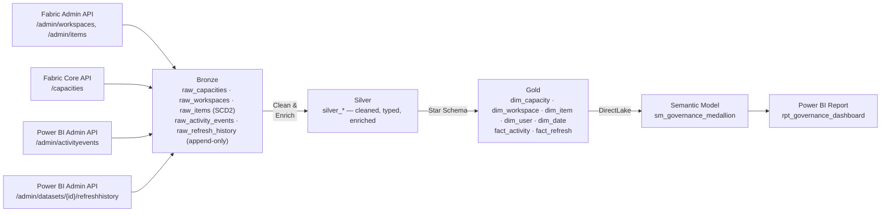

# Fabric Governance

[](https://github.com/amxavier/fabric-governance/actions/workflows/ci.yml)
[](https://github.com/amxavier/fabric-governance/actions/workflows/cd_deploy.yml)
[](https://github.com/amxavier/fabric-governance/actions/workflows/schedule_ingestion.yml)

Tenant-wide governance for **Microsoft Fabric**, built as a Medallion Architecture pipeline: who published or refreshed what, when, and whether it failed — so an incident like "this report stopped refreshing" can be diagnosed from data instead of digging through the Fabric portal by hand.

Data sources: Fabric Admin REST API (`/admin/workspaces`, `/admin/items`), Fabric Core REST API (`/capacities` — there's no admin-scoped equivalent), and the Power BI Admin REST API (`/admin/activityevents`, `/admin/datasets/{id}/refreshhistory`).

Sibling project: [microsoft-fabric-medallion-lakehouse](https://github.com/amxavier/microsoft-fabric-medallion-lakehouse) — this repo reuses its CI/CD and notebook conventions, but is architecturally independent (tenant-wide Admin API scope vs. per-workspace scope).

---

## Architecture



### Layer Responsibilities

| Layer | Table(s) | Description |
|-------|----------|-------------|
| **Bronze** | `raw_capacities`, `raw_workspaces`, `raw_items` | Tenant-wide snapshots, **SCD Type 2** — capacity/workspace/item metadata changes are preserved from the earliest layer |
| **Bronze** | `raw_activity_events`, `raw_refresh_history` | Append-only — audit events and refresh runs are immutable by nature |
| **Silver** | `silver_*` | Cleaned, typed, joined for readability (capacity name, workspace name, item type/name) |
| **Gold** | `dim_capacity`, `dim_workspace`, `dim_item`, `dim_user`, `dim_date` | Governance star schema dimensions |
| **Gold** | `fact_activity`, `fact_refresh` | One row per audit event / per refresh run, keyed to the dimensions above |

The core diagnostic pattern this schema enables: join `fact_refresh` failures against `fact_activity` for the same `item_id` in the preceding window — did someone change the owner, republish, or edit parameters right before it broke?

---

## Tech Stack

| Component | Technology |
|-----------|------------|
| Platform | Microsoft Fabric |
| Storage | OneLake (Delta Lake) |
| Processing | PySpark (Spark 3.x) |
| Orchestration | Fabric Data Pipeline |
| Semantic Layer | Power BI Semantic Model (DirectLake) |
| Reporting | Power BI Report (PBIR format) |
| CI/CD | GitHub Actions |
| Auth | Azure AD Service Principal (tenant Admin API scope) |
| Deployment | Fabric REST API (direct, 3-phase) |

---

## Environments

This project **reuses the same three Fabric workspaces** as the sibling [microsoft-fabric-medallion-lakehouse](https://github.com/amxavier/microsoft-fabric-medallion-lakehouse) project — same Service Principal, same tenant Admin API consent, same branch-to-workspace mapping. It does not provision separate infrastructure:

```
dev branch  →  DEV workspace  (dc072922-4ffb-4424-868c-28087b02ecba)
qa branch   →  QA workspace   (4bf443aa-d454-4c66-9025-a67fe4a287a8)
main branch →  PRD workspace  (990e6ef6-cc9a-47cf-8258-af5bc66bbad8)
```

Within each of those workspaces, this project adds its **own**, separately-named Lakehouse trio — `lh_governance_bronze`, `lh_governance_silver`, `lh_governance_gold` — so governance tables never mix with the crypto project's `lh_bronze`/`lh_silver`/`lh_gold` tables in the same workspace. Environment-specific GUIDs are managed in `config/valueSets/` — the `workspace_id` values are the real, already-existing IDs above; the `lh_governance_gold` lakehouse ID is still a placeholder until that lakehouse is created (see [Getting Started](#getting-started)).

---

## Workflows

| File | Trigger | Purpose |
|------|---------|---------|
| `ci.yml` | Every push | Validates all Fabric artifacts exist; runs `tests/` |
| `cd_deploy.yml` | Push to `dev`, `qa`, `main` | Deploys changed artifacts to the matching workspace via REST API |
| `schedule_ingestion.yml` | Daily at 06:00 UTC | Triggers `pl_governance_orchestration` in DEV, QA, and PRD |

Same 3-phase deploy order and patching strategy (pipeline notebook IDs, report `byConnection`, DirectLake OneLake URL) as the sibling project — see its README for the detailed rationale, which applies unchanged here.

---

## Semantic Model — DAX Measures

| Measure | Description |
|---------|-------------|
| `Total Refreshes` | Count of all refresh runs |
| `Failed Refreshes` | Count of refresh runs with a failure status |
| `Refresh Success Rate %` | Share of refreshes that succeeded |
| `Avg Refresh Duration (s)` | Average refresh duration |
| `Distinct Publishers` | Distinct users who triggered a logged activity |
| `Days Since Last Successful Refresh` | Staleness indicator per filter context |

---

## Project Structure

```
fabric-governance/
│
├── lh_governance_bronze.Lakehouse/
├── lh_governance_silver.Lakehouse/
├── lh_governance_gold.Lakehouse/
│
├── .github/workflows/
│   ├── ci.yml
│   ├── cd_deploy.yml
│   └── schedule_ingestion.yml
│
├── config/valueSets/
│   ├── dev.json / qa.json / main.json   # real workspace ID (reused) + OneLake URL (lakehouse ID still placeholder)
│
├── scripts/
│   ├── deploy.py                        # 3-phase deploy orchestration
│   ├── fabric_client.py                 # Fabric REST API + Power BI REST API wrapper
│   └── utils.py                         # Artifact helpers: patch, encode, diff
│
├── notebooks/
│   ├── nb_bronze_capacities.Notebook/
│   ├── nb_bronze_workspaces.Notebook/
│   ├── nb_bronze_items.Notebook/
│   ├── nb_bronze_activity_events.Notebook/
│   ├── nb_bronze_refresh_history.Notebook/
│   ├── nb_silver_capacities.Notebook/
│   ├── nb_silver_workspaces.Notebook/
│   ├── nb_silver_items.Notebook/
│   ├── nb_silver_activity_events.Notebook/
│   ├── nb_silver_refresh_history.Notebook/
│   └── nb_gold_governance_model.Notebook/
│
├── pipelines/pl_governance_orchestration.DataPipeline/
├── semantic models/sm_governance_medallion.SemanticModel/
├── report/rpt_governance_dashboard.Report/
│
├── tests/
├── requirements.txt
└── README.md
```

---

## Getting Started

This project deliberately reuses existing infrastructure rather than provisioning its own — the three Fabric workspaces, the Service Principal, and its tenant Admin API consent already exist for the sibling [microsoft-fabric-medallion-lakehouse](https://github.com/amxavier/microsoft-fabric-medallion-lakehouse) project. The only new infrastructure this project needs is its own Lakehouse trio inside those same workspaces.

### Remaining manual step (not automatable via CI/CD)

**Create `lh_governance_bronze`, `lh_governance_silver`, and `lh_governance_gold`** in each of the three existing workspaces (DEV/QA/PRD), then replace the placeholder lakehouse GUID (`00000000-0000-0000-0000-0000000000e3`, currently used for `lh_governance_gold` in every environment's `onelake_url` and in every notebook's METADATA/`known_lakehouses`) with the real ID Fabric assigns to `lh_governance_gold` once created — same pattern the sibling project uses for its own lakehouses. The Service Principal already has Contributor/Admin access to these workspaces, so no new role assignment is needed for `deploy.py` to publish into the new lakehouses.

### Required GitHub Secrets

Same Service Principal as the sibling repo — these are the same *values*, just configured as secrets in this repository too (GitHub secrets don't cross repositories even when the underlying identity is shared):

| Secret | Description |
|--------|-------------|
| `AZURE_TENANT_ID` | Azure AD Tenant ID |
| `AZURE_CLIENT_ID` | Shared Service Principal Application (Client) ID |
| `AZURE_CLIENT_SECRET` | Shared Service Principal Client Secret (Value, not ID) |
| `FABRIC_WORKSPACE_ID_DEV` / `_QA` / `_PRD` | Same workspace GUIDs as `config/valueSets/*.json` (not sensitive, but `schedule_ingestion.yml` reads them from secrets rather than the repo) |
| `FABRIC_PIPELINE_ID_DEV` / `_QA` / `_PRD` | `pl_governance_orchestration` item GUID per environment — only known after the first deploy |

### Setup

1. Create `lh_governance_bronze`, `lh_governance_silver`, `lh_governance_gold` in the DEV workspace (`dc072922-4ffb-4424-868c-28087b02ecba`).
2. Replace the placeholder lakehouse GUID `00000000-0000-0000-0000-0000000000e3` in `config/valueSets/dev.json` and in every notebook's METADATA block with the real `lh_governance_gold` ID (and the corresponding `lh_governance_bronze`/`lh_governance_silver` placeholders `...-e1`/`...-e2` where each notebook references its own default lakehouse).
3. Add the GitHub secrets above (reuse the same Service Principal values already used by the sibling repo).
4. Run `CD - Deploy to Fabric` in **full** mode to bootstrap DEV.
5. Repeat steps 1–2 for QA and PRD once DEV is validated, then push to `qa`/`main` to promote.

---

## Key Design Decisions

**SCD Type 2 in Bronze, not Silver** — Unlike the sibling lakehouse project (which applies SCD2 in Silver), this project versions capacity/workspace/item metadata as early as possible, in Bronze. The goal is change-history as a governance signal in its own right (e.g. "this workspace moved to a Trial capacity two days before refreshes started failing"), so it can't be lost or smoothed over by any transformation step downstream.

**Generic `raw_items`/`dim_item` instead of one table per item type** — Report, SemanticModel, Lakehouse, SQLEndpoint, DataPipeline, Notebook, and Dataflow are all rows in the same table, discriminated by `item_type`. This mirrors how the Admin API itself returns items and avoids maintaining eight near-duplicate schemas.

**Two separate audit sources, joined in Gold** — the Activity Log only attributes a user to *on-demand* refreshes; scheduled refreshes never show up there. `raw_refresh_history` captures every refresh (status, duration, error), while `raw_activity_events` captures who did what. Only by combining both in `fact_activity`/`fact_refresh` can "did this fail because of something someone changed?" be answered.

**Change-detection before SCD2 merge** — Bronze dimension notebooks only expire+reinsert a row when a tracked attribute actually changed, not on every daily run. Unlike the sibling project's crypto price data (which genuinely changes every day), tenant metadata is mostly stable day to day — versioning every row regardless would make the change history noise instead of signal.

---

## Author

**Andrelino Xavier** — Data Engineer
[GitHub](https://github.com/amxavier)

---

*Built as a Data Engineering portfolio project to demonstrate enterprise-realistic Fabric governance practices.*
