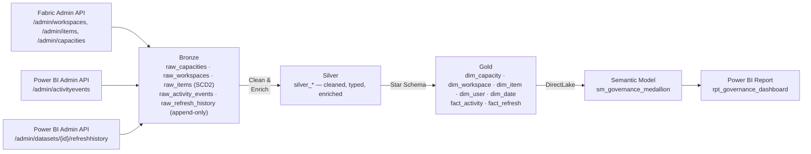

# Fabric Governance

[](https://github.com/amxavier/fabric-governance/actions/workflows/ci.yml)
[](https://github.com/amxavier/fabric-governance/actions/workflows/cd_deploy.yml)
[](https://github.com/amxavier/fabric-governance/actions/workflows/schedule_ingestion.yml)

Tenant-wide governance for **Microsoft Fabric**, built as a Medallion Architecture pipeline: who published or refreshed what, when, and whether it failed — so an incident like "this report stopped refreshing" can be diagnosed from data instead of digging through the Fabric portal by hand.

Data sources: Fabric Admin REST API (`/admin/workspaces`, `/admin/items`, `/admin/capacities`) and the Power BI Admin REST API (`/admin/activityevents`, `/admin/datasets/{id}/refreshhistory`).

Sibling project: [microsoft-fabric-medallion-lakehouse](https://github.com/amxavier/microsoft-fabric-medallion-lakehouse) — this repo reuses its CI/CD and notebook conventions, but is architecturally independent (tenant-wide Admin API scope vs. per-workspace scope).

---

## Architecture



### Layer Responsibilities

| Layer | Table(s) | Description |
|-------|----------|-------------|
| **Bronze** | `raw_capacities`, `raw_workspaces`, `raw_items` | Tenant-wide snapshots, **SCD Type 2** — capacity/workspace/item metadata changes are preserved from the earliest layer |
| **Bronze** | `raw_activity_events`, `raw_refresh_history` | Append-only — audit events and refresh runs are immutable by nature |
| **Silver** | `silver_*` | Cleaned, typed, joined for readability (capacity name, workspace name, item type/name) |
| **Gold** | `dim_capacity`, `dim_workspace`, `dim_item`, `dim_user`, `dim_date` | Governance star schema dimensions |
| **Gold** | `fact_activity`, `fact_refresh` | One row per audit event / per refresh run, keyed to the dimensions above |

The core diagnostic pattern this schema enables: join `fact_refresh` failures against `fact_activity` for the same `item_id` in the preceding window — did someone change the owner, republish, or edit parameters right before it broke?

---

## Tech Stack

| Component | Technology |
|-----------|------------|
| Platform | Microsoft Fabric |
| Storage | OneLake (Delta Lake) |
| Processing | PySpark (Spark 3.x) |
| Orchestration | Fabric Data Pipeline |
| Semantic Layer | Power BI Semantic Model (DirectLake) |
| Reporting | Power BI Report (PBIR format) |
| CI/CD | GitHub Actions |
| Auth | Azure AD Service Principal (tenant Admin API scope) |
| Deployment | Fabric REST API (direct, 3-phase) |

---

## Environments

Three isolated workspaces map 1:1 to Git branches, same convention as the sibling lakehouse project:

```
dev branch  →  DEV workspace   (development)
qa branch   →  QA workspace    (validation)
main branch →  PRD workspace   (production)
```

Each workspace contains its own `lh_bronze`, `lh_silver`, and `lh_gold` Lakehouses. Environment-specific GUIDs are managed in `config/valueSets/` — **currently placeholders**, see [Getting Started](#getting-started).

---

## Workflows

| File | Trigger | Purpose |
|------|---------|---------|
| `ci.yml` | Every push | Validates all Fabric artifacts exist; runs `tests/` |
| `cd_deploy.yml` | Push to `dev`, `qa`, `main` | Deploys changed artifacts to the matching workspace via REST API |
| `schedule_ingestion.yml` | Daily at 06:00 UTC | Triggers `pl_governance_orchestration` in DEV, QA, and PRD |

Same 3-phase deploy order and patching strategy (pipeline notebook IDs, report `byConnection`, DirectLake OneLake URL) as the sibling project — see its README for the detailed rationale, which applies unchanged here.

---

## Semantic Model — DAX Measures

| Measure | Description |
|---------|-------------|
| `Total Refreshes` | Count of all refresh runs |
| `Failed Refreshes` | Count of refresh runs with a failure status |
| `Refresh Success Rate %` | Share of refreshes that succeeded |
| `Avg Refresh Duration (s)` | Average refresh duration |
| `Distinct Publishers` | Distinct users who triggered a logged activity |
| `Days Since Last Successful Refresh` | Staleness indicator per filter context |

---

## Project Structure

```
fabric-governance/
│
├── .github/workflows/
│   ├── ci.yml
│   ├── cd_deploy.yml
│   └── schedule_ingestion.yml
│
├── config/valueSets/
│   ├── dev.json / qa.json / main.json   # workspace ID + OneLake URL (placeholders)
│
├── scripts/
│   ├── deploy.py                        # 3-phase deploy orchestration
│   ├── fabric_client.py                 # Fabric REST API + Power BI REST API wrapper
│   └── utils.py                         # Artifact helpers: patch, encode, diff
│
├── notebooks/
│   ├── nb_bronze_capacities.Notebook/
│   ├── nb_bronze_workspaces.Notebook/
│   ├── nb_bronze_items.Notebook/
│   ├── nb_bronze_activity_events.Notebook/
│   ├── nb_bronze_refresh_history.Notebook/
│   ├── nb_silver_capacities.Notebook/
│   ├── nb_silver_workspaces.Notebook/
│   ├── nb_silver_items.Notebook/
│   ├── nb_silver_activity_events.Notebook/
│   ├── nb_silver_refresh_history.Notebook/
│   └── nb_gold_governance_model.Notebook/
│
├── pipelines/pl_governance_orchestration.DataPipeline/
├── semantic models/sm_governance_medallion.SemanticModel/
├── report/rpt_governance_dashboard.Report/
│
├── tests/
├── requirements.txt
└── README.md
```

---

## Getting Started

### Prerequisites (manual — not automatable via CI/CD)

1. **Three Fabric workspaces** (DEV/QA/PRD), each with `lh_bronze`, `lh_silver`, `lh_gold` Lakehouses.
2. **A dedicated Service Principal** (recommended: `sp-fabric-governance`, separate from the sibling project's `sp-fabric-cicd` — tenant-wide Admin API access is a much larger privilege scope than per-workspace deploy):
   - Entra ID API permission: Power BI Service → `Tenant.Read.All` (Application, admin consent granted)
   - Enabled in the Fabric Admin Portal tenant settings: "Service principals can access read-only Admin APIs" (and the Power BI equivalent for Activity Events), with the SP in the allowed security group
   - Workspace Admin/Contributor role on the 3 governance workspaces (needed for `deploy.py` to publish notebooks/pipeline/semantic model/report — not for the Bronze notebooks' own tenant-wide reads, which go through the Admin API instead)

### Required GitHub Secrets

| Secret | Description |
|--------|-------------|
| `AZURE_TENANT_ID` | Azure AD Tenant ID |
| `AZURE_CLIENT_ID` | `sp-fabric-governance` Application (Client) ID |
| `AZURE_CLIENT_SECRET` | `sp-fabric-governance` Client Secret (Value, not ID) |
| `FABRIC_WORKSPACE_ID_DEV` / `_QA` / `_PRD` | Workspace GUIDs |
| `FABRIC_PIPELINE_ID_DEV` / `_QA` / `_PRD` | `pl_governance_orchestration` item GUID per environment |

### Setup

1. Create the three Fabric workspaces and their Lakehouses.
2. Register `sp-fabric-governance` and grant it the Admin API permissions above; add it as a Member to all three workspaces.
3. Replace the DEV placeholder GUIDs before the first deploy:
   - `config/valueSets/dev.json` — `workspace_id`, `onelake_url`
   - Every notebook's `.platform`/METADATA lakehouse IDs (`00000000-...-0001` workspace, `...-b0`/`-c0`/`-d0` lakehouses) — these mirror the sibling project's convention of storing real DEV IDs in the repo, patched only for QA/PRD by `deploy.py`
   - `semantic models/sm_governance_medallion.SemanticModel/definition/expressions.tmdl` — the DirectLake OneLake URL
4. Add all required secrets to GitHub repository settings.
5. Run `CD - Deploy to Fabric` in **full** mode for each environment to bootstrap.
6. Push to `dev` to trigger selective deploys automatically.

---

## Key Design Decisions

**SCD Type 2 in Bronze, not Silver** — Unlike the sibling lakehouse project (which applies SCD2 in Silver), this project versions capacity/workspace/item metadata as early as possible, in Bronze. The goal is change-history as a governance signal in its own right (e.g. "this workspace moved to a Trial capacity two days before refreshes started failing"), so it can't be lost or smoothed over by any transformation step downstream.

**Generic `raw_items`/`dim_item` instead of one table per item type** — Report, SemanticModel, Lakehouse, SQLEndpoint, DataPipeline, Notebook, and Dataflow are all rows in the same table, discriminated by `item_type`. This mirrors how the Admin API itself returns items and avoids maintaining eight near-duplicate schemas.

**Two separate audit sources, joined in Gold** — the Activity Log only attributes a user to *on-demand* refreshes; scheduled refreshes never show up there. `raw_refresh_history` captures every refresh (status, duration, error), while `raw_activity_events` captures who did what. Only by combining both in `fact_activity`/`fact_refresh` can "did this fail because of something someone changed?" be answered.

**Change-detection before SCD2 merge** — Bronze dimension notebooks only expire+reinsert a row when a tracked attribute actually changed, not on every daily run. Unlike the sibling project's crypto price data (which genuinely changes every day), tenant metadata is mostly stable day to day — versioning every row regardless would make the change history noise instead of signal.

---

## Author

**Andrelino Xavier** — Data Engineer
[GitHub](https://github.com/amxavier)

---

*Built as a Data Engineering portfolio project to demonstrate enterprise-realistic Fabric governance practices.*
