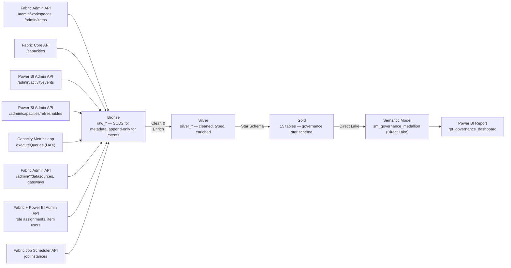

# Fabric Governance

[](https://github.com/amxavier/fabric-governance/actions/workflows/ci.yml)
[](https://github.com/amxavier/fabric-governance/actions/workflows/cd_deploy.yml)
[](https://github.com/amxavier/fabric-governance/actions/workflows/schedule_ingestion.yml)

Tenant-wide governance for **Microsoft Fabric**, built as a Medallion Architecture pipeline: who published or refreshed what, when, whether it failed, what it cost, and which items nobody uses anymore — so an incident like "this report stopped refreshing" or a question like "can we shrink our capacity" can be answered from data instead of digging through the Fabric portal by hand.

Live in three environments (DEV/QA/PRD), each a full, independent copy of the pipeline running on its own schedule against its own tenant scan.

Sibling project: [microsoft-fabric-medallion-lakehouse](https://github.com/amxavier/microsoft-fabric-medallion-lakehouse) — this repo reuses its CI/CD and notebook conventions, but is architecturally independent (tenant-wide Admin API scope vs. per-workspace scope), and reuses its three Fabric workspaces and Service Principal rather than provisioning its own.

---

## What it answers

- **Inventory** — every workspace, item (Report, SemanticModel, Lakehouse, SQLEndpoint, DataPipeline, Notebook, Dataflow, Warehouse, SQLDatabase, App), and capacity in the tenant, with full change history.
- **"Why did this break?"** — join a refresh failure against the activity log for the same item in the preceding window: did someone change the owner, republish, or edit parameters right before it broke?
- **"What does this cost?"** — capacity unit (CU) consumption by item and by day, cross-referenced against activity/refresh events.
- **"What can we clean up?"** — items with no refresh, job, or activity signal in 45+ days, classified Active / Inactive / Cleanup Candidate.
- **"Who can see this?"** — workspace role assignments and per-item sharing, an LGPD/access-audit angle across every governed item.

---

## Architecture



### Layer Responsibilities

| Layer | Table(s) | Description |
|-------|----------|-------------|
| **Bronze** | `raw_capacities`, `raw_workspaces`, `raw_items`, `raw_gateways`, `raw_workspace_role_assignments` | Tenant-wide snapshots, **SCD Type 2** — metadata changes preserved from the earliest layer |
| **Bronze** | `raw_activity_events`, `raw_refresh_history`, `raw_capacity_metrics`, `raw_capacity_cu_detail`, `raw_dataset_datasources`, `raw_item_users`, `raw_item_job_history` | Append-only or daily-snapshot — events and usage are immutable/point-in-time by nature |
| **Silver** | `silver_*` (12 notebooks) | Cleaned, typed, joined for readability |
| **Gold** | `dim_capacity`, `dim_workspace`, `dim_item`, `dim_user`, `dim_date`, `dim_gateway` | Governance star schema dimensions |
| **Gold** | `fact_activity`, `fact_refresh`, `fact_capacity_consumption`, `fact_capacity_utilization`, `fact_item_lifecycle`, `fact_item_job_history` | Event/measure facts, keyed to the dimensions above |
| **Gold** | `bridge_item_datasource`, `bridge_workspace_access`, `bridge_item_access` | Many-to-many lineage/access bridges (no measures of their own) |

The core diagnostic pattern this schema enables: join `fact_refresh` failures against `fact_activity` for the same `item_id` in the preceding window — did someone change the owner, republish, or edit parameters right before it broke?

---

## Tech Stack

| Component | Technology |
|-----------|------------|
| Platform | Microsoft Fabric |
| Storage | OneLake (Delta Lake) |
| Processing | PySpark (Spark 3.x) |
| Orchestration | Fabric Data Pipeline (24 activities) |
| Semantic Layer | Power BI Semantic Model (Direct Lake), 15 tables, 21 relationships, 26 DAX measures |
| Reporting | Power BI Report (PBIR format), 4 pages |
| CI/CD | GitHub Actions (6 workflows) |
| Auth | Azure AD Service Principal, with a delegated-user fallback for endpoints that reject app-only auth (see below) |
| Deployment | Fabric REST API (direct, 3-phase) — no native Deployment Pipelines |

---

## Environments

This project **reuses the same three Fabric workspaces and Service Principal** as the sibling [microsoft-fabric-medallion-lakehouse](https://github.com/amxavier/microsoft-fabric-medallion-lakehouse) project.

```
dev branch  →  DEV workspace  (lakehouses_dev)
qa branch   →  QA workspace   (lakehouses_qa)
main branch →  PRD workspace  (lakehouses_prd)
```

Within each workspace, this project adds its **own**, separately-named Lakehouse trio — `lh_governance_bronze`, `lh_governance_silver`, `lh_governance_gold` — so governance tables never mix with the sibling project's `lh_bronze`/`lh_silver`/`lh_gold` tables in the same workspace. `scripts/provision_lakehouses.py <branch>` creates them and wires the real IDs into `config/valueSets/<branch>.json` automatically — see [Getting Started](#getting-started).

All three environments are live, validated end to end (full daily pipeline run, real data in the report), and kept deliberately independent: `main` only receives a change once it's been validated on `dev` then `qa`.

---

## Workflows

| File | Trigger | Purpose |
|------|---------|---------|
| `ci.yml` | Every push | Validates every Fabric artifact's structure; runs `tests/` |
| `cd_deploy.yml` | `ci.yml` succeeding on `dev`/`qa`/`main` | Deploys changed artifacts to the matching workspace via REST API |
| `schedule_ingestion.yml` | Daily at 06:00 UTC (PRD); manual for DEV/QA | Triggers `pl_governance_orchestration` |
| `provision_lakehouses.yml` | Manual | One-off: create the Lakehouse trio in a new environment |
| `deploy_semantic_model.yml` | Manual | One-off: provision `sm_governance_medallion` from scratch in a new environment |
| `pull_semantic_model.yml` | Manual | Syncs a live item's current definition (semantic model, pipeline, report) back into git |

**`cd_deploy.yml` only runs after `ci.yml` succeeds** (via `workflow_run`, not a direct push trigger) — a commit that fails a test never reaches a live workspace. `deploy.py` itself is a 3-phase orchestrator (Notebooks+SemanticModel → DataPipeline, patching notebook IDs → Report, patching the semantic model connection), and aborts Phase 2/3 outright if anything in Phase 1 failed, rather than risk publishing a pipeline or report that references an item that doesn't actually exist yet.

`sm_governance_medallion` is deliberately excluded from `cd_deploy.yml`'s normal flow — see [Semantic Model Lifecycle](#semantic-model-lifecycle) below.

---

## Semantic Model Lifecycle

Direct Lake models deployed in bulk via REST/TMDL — including relationships marked `isActive: false` to break an ambiguous path (a common shape here: two fact tables sharing two dimensions) — are rejected by Fabric's import validator ("ambiguous paths between X and Y"), even though the exact same graph is valid once built incrementally. Because of this, `sm_governance_medallion` is **not** managed by the normal deploy flow; it's provisioned once per environment via a two-phase process and maintained interactively afterward:

1. `python scripts/deploy_semantic_model.py <branch>` (or the `Deploy Semantic Model` workflow) — deploys the TMDL via REST with `relationships.tmdl` emptied, sidestepping the bulk-import validator entirely.
2. Open `nb_setup_semantic_model_relationships.Notebook` in the target workspace, point `DATASET`/`WORKSPACE` at it, and run it top to bottom — adds every relationship via TOM (`sempy_labs.tom`) one at a time in a single session (incremental writes sidestep the same validator), then refreshes the model and confirms real data comes back through Direct Lake.
3. New tables added later (e.g. the lineage/access bridge tables) follow the same pattern: add the table via the portal's **Edit tables** (Direct Lake, picks straight from the Lakehouse), then add just its new relationships via the same TOM script.

This must be run interactively (your own sign-in) — TOM/XMLA write operations reject the Service Principal's app-only token on this tenant, same as the `/admin/*` REST APIs below. `scripts/pull_item_definition.py` (or the `pull_semantic_model.yml` workflow) syncs the live, interactively-maintained definition back into git afterward, for documentation — `deploy.py` never writes to it.

**A model created via the Service Principal (through `deploy_semantic_model.py`) is SP-owned**, which can block the portal's **Edit tables**/Power Query features ("ask the model owner to enable granular access control..."). Fix: **Take ownership** of the item as yourself (`...` menu on the item → Take over) — safe for a Direct Lake model specifically, since it has no stored data-source credential tied to the owner the way an Import-mode model would, and the item's ID (what the report and pipeline actually bind to) doesn't change.

---

## Delegated Authentication for `/admin/*`

Every `/admin/*`-shaped endpoint this project depends on — Fabric's `/v1/admin/workspaces`/`/v1/admin/items`, Power BI's `/admin/activityevents`/`/admin/capacities/refreshables`, `executeQueries` against the Capacity Metrics app, and per-item sharing (`/admin/*/users`) — **rejects the Service Principal outright**, regardless of how it authenticates or how the tenant is configured. Confirmed via decoded JWTs (genuine, correctly-scoped app-only tokens, still rejected) and matching reports from the [Fabric community](https://community.fabric.microsoft.com/t5/Developer/Admin-API-s-and-Service-Principal-Authentication-401/m-p/3134240) — several of these APIs are Preview and simply don't support app-only auth yet.

**The workaround**: the 8 affected Bronze notebooks (`nb_bronze_workspaces`, `nb_bronze_items`, `nb_bronze_activity_events`, `nb_bronze_refresh_history`, `nb_bronze_capacity_metrics`, `nb_bronze_capacity_cu_detail`, `nb_bronze_gateways`, `nb_bronze_permissions`) exchange a stored **refresh token** (obtained once via interactive sign-in) for a fresh delegated access token on every run. The implementation lives in one place, `nb_util_delegated_auth.Notebook`, pulled in via `%run nb_util_delegated_auth` — not duplicated per notebook. The refresh token — and the new one Microsoft issues on every redemption — lives in a small Delta table, `_auth_delegated`, inside `lh_governance_bronze`; `tenant_id`/`client_id` aren't secrets, and the refresh token never leaves the lakehouse (same protection level a Key Vault would add here, at zero cost).

All 8 notebooks share one token, so they're serialized into a single dependency chain in the pipeline (`workspaces → items → activity_events → capacity_metrics → capacity_cu_detail → gateways → permissions → refresh_history`) rather than run in parallel — two concurrent redemptions of the same refresh token invalidate each other.

### One-time bootstrap (per environment)

Run this interactively in any notebook attached to the environment's `lh_governance_bronze` (delete the cell afterward — it briefly holds a device code, not a secret):

```python
import requests
from datetime import datetime, timezone

TENANT_ID = "<tenant id>"                  # not a secret
CLIENT_ID = "<sp-fabric-cicd client id>"    # not a secret — App Registration needs
                                             # "Allow public client flows" = Yes

dc = requests.post(
    f"https://login.microsoftonline.com/{TENANT_ID}/oauth2/v2.0/devicecode",
    data={"client_id": CLIENT_ID, "scope": "https://api.fabric.microsoft.com/.default offline_access"},
).json()
print(dc["message"])  # open the URL, enter the code, sign in (MFA if prompted)

# Run this cell AFTER completing the browser sign-in above:
poll = requests.post(
    f"https://login.microsoftonline.com/{TENANT_ID}/oauth2/v2.0/token",
    data={
        "grant_type": "urn:ietf:params:oauth:grant-type:device_code",
        "client_id": CLIENT_ID,
        "device_code": dc["device_code"],
    },
).json()

_lh = notebookutils.lakehouse.get("lh_governance_bronze")
spark.createDataFrame([{
    "tenant_id": TENANT_ID,
    "client_id": CLIENT_ID,
    "refresh_token": poll["refresh_token"],
    "updated_at": datetime.now(timezone.utc).isoformat(),
}]).write.format("delta").mode("overwrite").save(f"{_lh['properties']['abfsPath']}/Tables/_auth_delegated")
```

**Prerequisites:** the app registration needs **"Allow public client flows"** enabled, and a **Delegated** (not Application) `Tenant.Read.All` permission for Power BI Service with admin consent. The signed-in user needs whatever role grants Admin API visibility in the tenant.

**Operational note:** the refresh token is valid on a sliding window (~90 days of inactivity before invalidation) and rotates automatically on every use, so daily runs keep it alive indefinitely. If it ever expires, re-run this bootstrap once for that environment.

---

## Key Design Decisions

**SCD Type 2 in Bronze, not Silver** — versions capacity/workspace/item metadata as early as possible, so change history (e.g. "this workspace moved to a Trial capacity two days before refreshes started failing") can't be lost or smoothed over by a downstream transformation.

**Generic `raw_items`/`dim_item` instead of one table per item type** — Report, SemanticModel, Lakehouse, SQLEndpoint, DataPipeline, Notebook, Dataflow, Warehouse, SQLDatabase, and App are all rows in one table, discriminated by `item_type` — mirrors how the Admin API itself returns items.

**Two separate audit sources, joined in Gold** — the Activity Log only attributes a user to *on-demand* refreshes; scheduled refreshes never show up there. `raw_refresh_history` captures every refresh (status, duration, error); `raw_activity_events` captures who did what. Combining both in `fact_activity`/`fact_refresh` is what makes "did this fail because of something someone changed?" answerable.

**Two capacity-cost sources, not one** — `MetricsByItem` is a rolling 14-day total per item (fine to chart as a trend, mathematically wrong to sum across months — each operation is double-counted across ~14 snapshots). `CUDetail` has immutable, already-happened time buckets at the capacity level (safely summable, but no per-item breakdown). Used together: `fact_capacity_consumption` (item-level trend) and `fact_capacity_utilization` (capacity-level, genuinely additive).

**Change-detection before SCD2 merge** — Bronze dimension notebooks only expire+reinsert a row when a tracked attribute actually changed, not on every run. Tenant metadata is mostly stable day to day; versioning every row regardless would turn the change history into noise.

---

## Project Structure

```
fabric-governance/
│
├── lh_governance_bronze.Lakehouse/
├── lh_governance_silver.Lakehouse/
├── lh_governance_gold.Lakehouse/
│
├── .github/workflows/
│   ├── ci.yml
│   ├── cd_deploy.yml
│   ├── schedule_ingestion.yml
│   ├── provision_lakehouses.yml
│   ├── deploy_semantic_model.yml
│   └── pull_semantic_model.yml
│
├── config/valueSets/
│   └── dev.json / qa.json / main.json   # real workspace_id + onelake_url per environment
│
├── scripts/
│   ├── deploy.py                        # 3-phase deploy orchestration
│   ├── deploy_semantic_model.py         # provisions sm_governance_medallion in a new environment
│   ├── provision_lakehouses.py          # creates the Lakehouse trio in a new environment
│   ├── pull_item_definition.py          # syncs a live item's definition back into git
│   ├── fabric_client.py                 # Fabric + Power BI REST API wrapper, with retry/backoff
│   └── utils.py                         # Artifact helpers: patch, encode, diff
│
├── notebooks/
│   ├── nb_util_delegated_auth.Notebook/         # shared token-exchange helper, %run by 8 notebooks
│   ├── nb_setup_semantic_model_relationships.Notebook/
│   ├── nb_bronze_*.Notebook/                    # 10 notebooks
│   ├── nb_silver_*.Notebook/                    # 12 notebooks
│   └── nb_gold_governance_model.Notebook/
│
├── pipelines/pl_governance_orchestration.DataPipeline/
├── semantic models/sm_governance_medallion.SemanticModel/
├── report/rpt_governance_dashboard.Report/
│
├── tests/
├── requirements.txt
└── README.md
```

---

## Getting Started

### Prerequisites

The three Fabric workspaces and the Service Principal are reused from the sibling [microsoft-fabric-medallion-lakehouse](https://github.com/amxavier/microsoft-fabric-medallion-lakehouse) project. This project's only new infrastructure is its own Lakehouse trio inside those same workspaces, and its own semantic model + report + pipeline.

### Required GitHub Secrets

| Secret | Description |
|--------|-------------|
| `AZURE_TENANT_ID` | Azure AD Tenant ID |
| `AZURE_CLIENT_ID` | Shared Service Principal Application (Client) ID |
| `AZURE_CLIENT_SECRET` | Shared Service Principal Client Secret (Value, not ID) |
| `FABRIC_WORKSPACE_ID_DEV` / `_QA` / `_PRD` | Workspace GUIDs (also in `config/valueSets/*.json`) |
| `FABRIC_PIPELINE_ID_DEV` / `_QA` / `_PRD` | `pl_governance_orchestration` item GUID per environment — known after the first deploy |

### Standing up a new environment

1. `python scripts/provision_lakehouses.py <branch>` (or the `Provision Lakehouses` workflow) — creates `lh_governance_bronze/silver/gold` and wires the real `lh_governance_gold` ID into `config/valueSets/<branch>.json`.
2. Run `CD - Deploy to Fabric` in **full** mode — publishes all notebooks, the pipeline, and the report (the report step will fail until step 3 is done; that's expected).
3. Provision the semantic model — see [Semantic Model Lifecycle](#semantic-model-lifecycle) above — then re-run the full deploy so the report finds it.
4. Run the [delegated-auth bootstrap](#one-time-bootstrap-per-environment) once for this environment.
5. Point the pipeline's `refresh_semantic_model` activity at this environment's semantic model (open the pipeline in the portal, re-point the `PBISemanticModelRefresh` activity, creating a new Connection if prompted), then run `pull_semantic_model.yml` against `pl_governance_orchestration` to sync the corrected IDs back into git.
6. Trigger `schedule_ingestion.yml` manually (`environments` input) to run the pipeline once and confirm real data reaches the report.

---

## Author

**Andrelino Xavier** — Data Engineer
[GitHub](https://github.com/amxavier)

---

*Built as a Data Engineering portfolio project to demonstrate enterprise-realistic Fabric governance practices — including the CI/CD and platform-limitation problem-solving that a real production rollout across three environments actually requires.*
